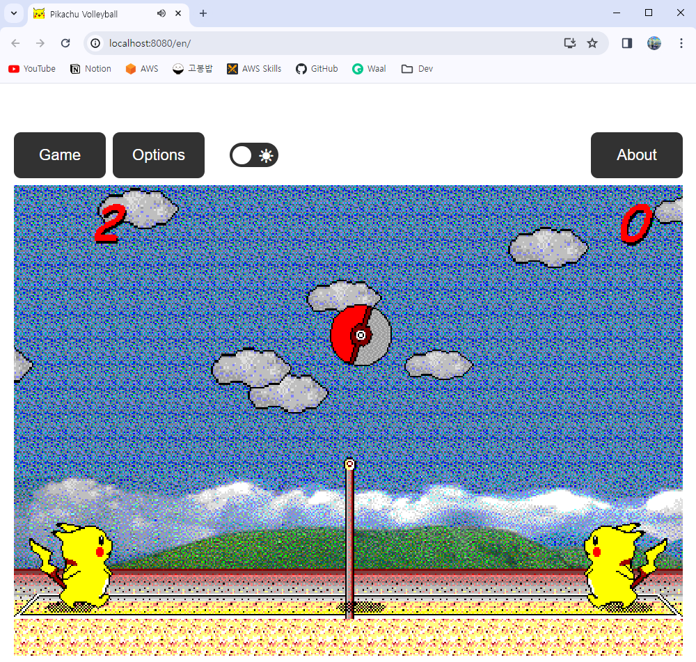

# Pikachu Volleyball Container

> [!NOTE]
> Forked from [gorisanson/pikachu-volleyball](https://github.com/gorisanson/pikachu-volleyball)



## Run

```bash
docker build -t pikachu-volleyball .
docker run -d -p 8080:8080 pikachu-volleyball
```
